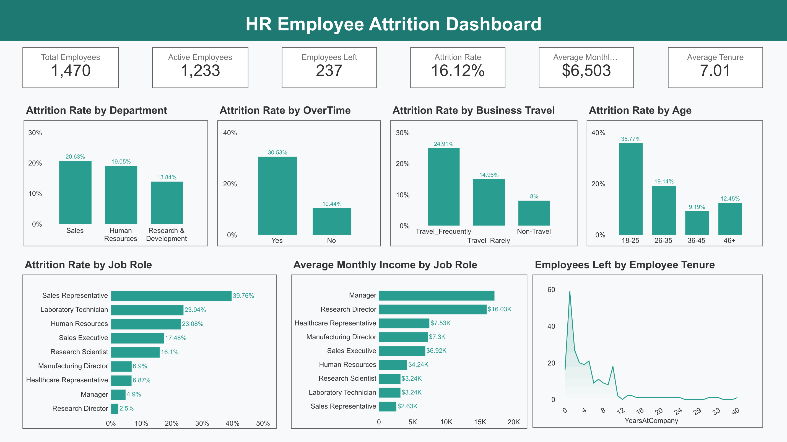

# HR Employee Attrition Analysis

## Project Overview

This project analyzes employee data using SQL and Looker Studio to identify key factors associated with employee attrition. The analysis provides data-driven insights into employee turnover across departments, job roles, age groups, overtime, business travel, and employee tenure through an interactive dashboard.

---

## Business Questions

1. Which department has the highest employee attrition rate?
2. Which job roles experience the highest employee attrition rate?
3. Which age groups have the highest employee attrition rate?
4. At what stage of an employee's tenure is attrition most likely to occur?
5. Do employees who work overtime have a higher attrition rate?
6. Does business travel appear to be associated with employee attrition?
7. How does average monthly income differ across job roles?

---

## Tools Used

- SQL
- Looker Studio

---

## Dataset

- Total Records: 1,470
- Total Columns: 35
- Source: Kaggle HR Analytics Employee Attrition & Performance Dataset

---

## Dashboard Preview

---

## Looker Studio Dashboard

🔗 **Dashboard Link:** https://datastudio.google.com/reporting/7768b563-d870-43bf-aedb-ae6cc30fbcc5 

---

## Key Insights

- The dataset contains **1,470 employees**, with **237 employees leaving**, resulting in an overall **16.12% attrition rate**.
- **Sales** has the highest attrition rate among departments at **20.63%**, followed by Human Resources at **19.05%**.
- **Sales Representatives** have the highest attrition rate among job roles at **39.76%**.
- Employees aged **18–25** have the highest attrition rate at **35.77%**, indicating higher employee turnover among younger employees.
- Employee attrition is concentrated in the **early stages of tenure**, with the highest number of employees leaving occurring during the first years at the company.
- Employees who work **overtime** have a significantly higher attrition rate (**30.53%**) compared with employees who do not work overtime (**10.44%**).
- Employees who **travel frequently** have the highest attrition rate among business travel categories at **24.91%**.
- **Managers** have the highest average monthly income among the analyzed job roles, with an average of approximately **$17.2K**.

---

## Business Recommendations
- Prioritize retention strategies in the Sales department by evaluating workload, sales targets, employee satisfaction, and management support. Regular employee feedback can help identify factors contributing to employee turnover. The company can also establish clearer career development paths for Sales employees to provide opportunities for advancement. 
- Focus on Sales Representatives, which have the highest attrition rate among job roles, through career development programs, workload evaluation, and performance-based incentives. Comparing their working conditions with lower-attrition roles can help identify areas that require further attention. 
- Strengthen retention strategies for younger employees, particularly those aged 18–25, through structured onboarding, training, mentoring, regular feedback, and clear career development opportunities. 
- Strengthen onboarding and employee engagement during the early stages of employment by providing clear job expectations, regular feedback, mentoring, and career development opportunities to reduce early-tenure attrition. 
- Review workload and overtime management by evaluating workload distribution, staffing needs, and work processes. The company should also support work-life balance and employee well-being, particularly among employees who frequently work overtime. 
- Evaluate working conditions for employees who frequently travel for business by reviewing travel frequency, workload, travel schedules, recovery time, and organizational support. Travel-related benefits, flexible scheduling, and workload adjustments can be considered to support employee well-being and retention.

---

## Repository Contents

| File | Description |
| --- | --- |
| `README.md` | Project documentation and summary |
| `employee_attrition_analysis.sql` | SQL queries used for data cleaning, KPI calculation, and business analysis |
| `dashboard.png` | Looker Studio dashboard preview |
